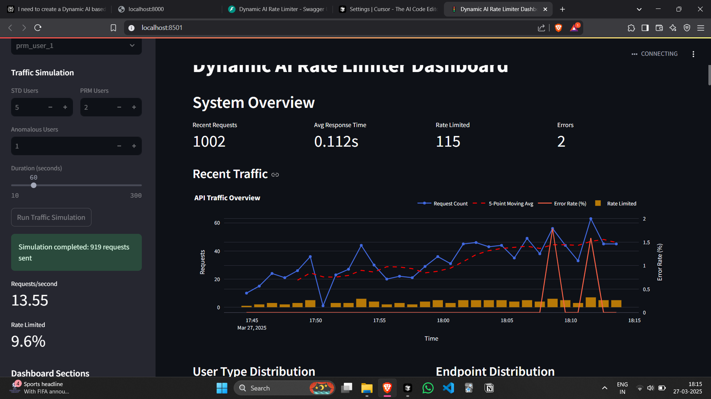
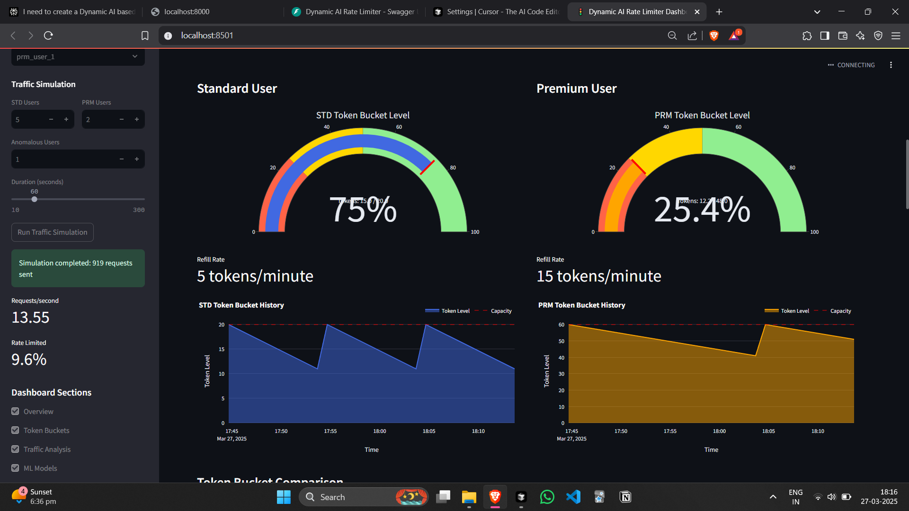
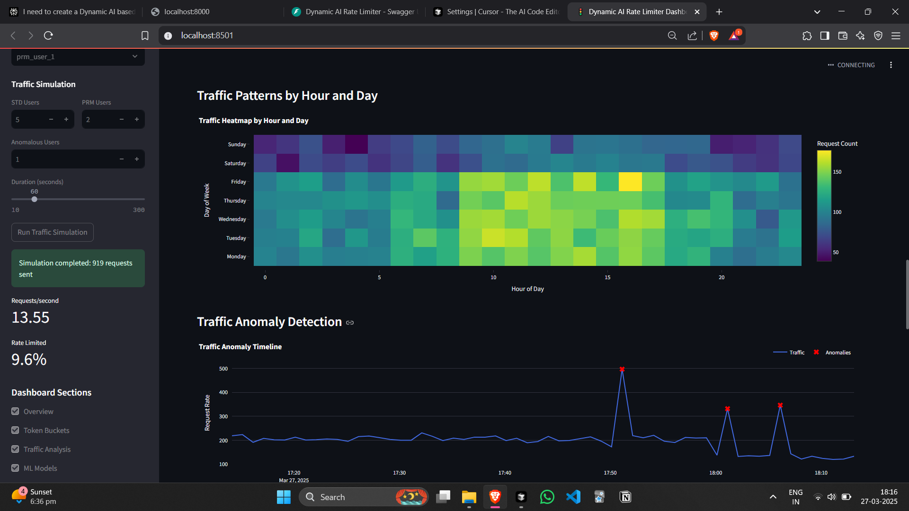
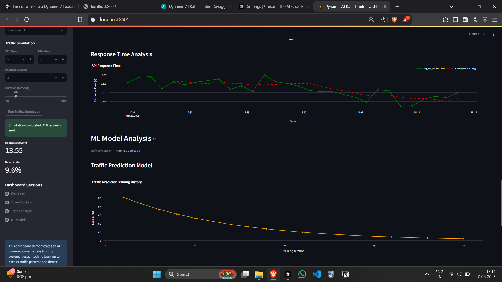
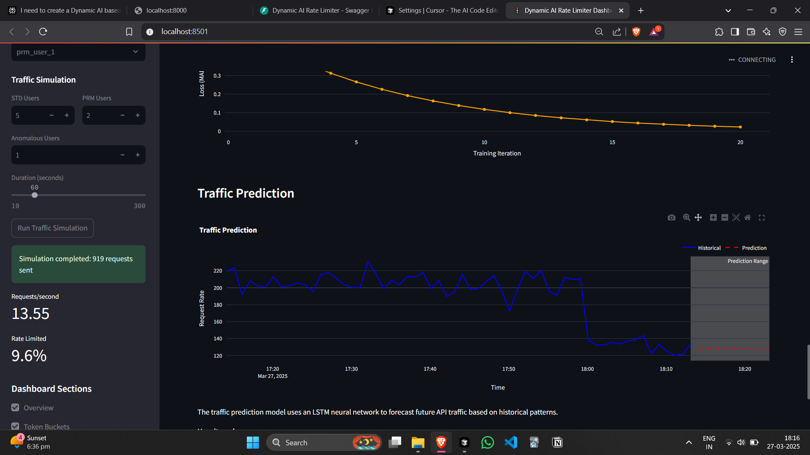

# Dynamic AI-based API Rate Limiting System

A sophisticated rate limiting system for APIs that uses machine learning to dynamically adjust rate limits based on traffic patterns, anomaly detection, and user types.

## Table of Contents
- [Overview](#overview)
- [Features](#features)
- [Architecture](#architecture)
- [Requirements](#requirements)
- [Installation](#installation)
- [Running the Application](#running-the-application)
- [How to Test the System](#how-to-test-the-system)
- [How It Works](#how-it-works)
- [Configuration](#configuration)
- [Troubleshooting](#troubleshooting)
- [Further Development](#further-development)

## Overview

This project implements an advanced API rate limiting system that uses artificial intelligence to dynamically adjust rate limits based on real-time traffic analysis, historical patterns, and anomaly detection. Unlike traditional static rate limiters, this system can adapt to changing traffic conditions to provide better protection for backend services while maintaining good user experience.

## Features

- **Token Bucket Rate Limiting**: Implements a token bucket algorithm for precise rate limiting
- **User-Based Rate Limits**: Different rate limits for standard and premium users
- **Dynamic Adjustment**: ML-based adjustment of rate limits based on traffic patterns
- **Traffic Prediction**: LSTM neural network to predict upcoming traffic patterns
- **Anomaly Detection**: Real-time detection of unusual traffic patterns or potential DDoS attacks
- **Interactive Dashboard**: Real-time visualization of system status and traffic patterns
- **Traffic Simulation**: Tools to generate test traffic with various user profiles
- **API Documentation**: Interactive Swagger documentation

## Architecture

The system consists of several key components:

1. **FastAPI Backend**: Core API server with rate limiting middleware
2. **Rate Limiting Engine**: Token bucket implementation with dynamic adjustments
3. **Traffic Collector**: Gathers and stores traffic data for analysis
4. **ML Models**: 
   - Traffic Predictor (LSTM neural network)
   - Anomaly Detector (Isolation Forest + feature engineering)
5. **Streamlit Dashboard**: Real-time visualization and system monitoring
6. **Traffic Simulator**: Tool to generate realistic API traffic patterns

## Requirements

- Python 3.9+
- FastAPI
- Streamlit
- Pandas
- NumPy
- Scikit-learn
- TensorFlow/Keras
- Plotly
- SQLite (for data storage)

## Installation

1. Clone the repository:
   ```bash
   git clone https://github.com/yourusername/dynamic-ai-rate-limiter.git
   cd dynamic-ai-rate-limiter
   ```

2. Create and activate a virtual environment:
   ```bash
   python -m venv venv
   # On Windows
   venv\Scripts\activate
   # On Linux/Mac
   source venv/bin/activate
   ```

3. Install dependencies:
   ```bash
   pip install -r requirements.txt
   ```

## Running the Application

The application consists of two main services: the API server and the dashboard.

### Starting the API Server

```bash
python -m uvicorn app.main:app --reload
```

This will start the FastAPI server on http://localhost:8000. You can access the interactive API documentation at http://localhost:8000/docs.

### Starting the Dashboard

```bash
streamlit run dashboard/app.py
```

This will start the Streamlit dashboard on http://localhost:8501.

## How to Test the System

There are several ways to test and verify the functionality of the system:

### 1. Using the Traffic Simulator in the Dashboard

The dashboard includes a built-in traffic simulator that allows you to generate various traffic patterns:

1. Open the dashboard at http://localhost:8501
2. Select a user from the dropdown (e.g., `std_user_1` or `prm_user_1`)
3. Configure the simulation parameters:
   - STD Users: Number of standard users (1-20)
   - PRM Users: Number of premium users (1-10)
   - Anomalous Users: Number of users with anomalous behavior (0-5)
   - Duration: Length of the simulation in seconds (10-300)
4. Click "Run Traffic Simulation"
5. Observe the various visualizations updating in real-time

### 2. Testing Different Scenarios

To thoroughly test the system, try the following scenarios:

#### Basic Testing
- Run a simulation with 5 STD users, 2 PRM users, and 0 anomalous users for 60 seconds
- Check that the token bucket visualizations show reasonable usage
- Verify that traffic graphs display the generated traffic

#### Stress Testing
- Run a simulation with maximum users (20 STD, 10 PRM, 5 anomalous) for 300 seconds
- Observe how the rate limiting percentage increases
- Check how token buckets deplete over time

#### Anomaly Detection Testing
- Run a simulation with 3-5 anomalous users
- Look at the Anomaly Detection graph to see if red markers appear at traffic spikes
- Verify that the system detects and highlights unusual patterns

#### User Type Comparison
- Run separate simulations with only STD users vs. only PRM users
- Compare how token buckets behave differently for each user type
- Check the User Type Distribution visualization for accuracy

#### ML Model Verification
- Run multiple simulations in sequence
- Check if the traffic prediction model adjusts based on observed patterns
- Verify that historical data is being captured correctly

### 3. Direct API Testing

You can also test the API directly using curl or tools like Postman:

```bash
# Test with a standard user
curl -X GET "http://localhost:8000/api/api/ping" -H "X-User-ID: std_user_1" -H "X-User-Type: STD"

# Test with a premium user
curl -X GET "http://localhost:8000/api/api/ping" -H "X-User-ID: prm_user_1" -H "X-User-Type: PRM"

# Check rate limit status
curl -X GET "http://localhost:8000/api/api/rate-limit-status" -H "X-User-ID: std_user_1" -H "X-User-Type: STD"

# Generate a burst of traffic to trigger rate limiting
curl -X GET "http://localhost:8000/api/api/burst/20" -H "X-User-ID: std_user_1" -H "X-User-Type: STD"
```

### 4. Verifying Rate Limiting Behavior

To verify that rate limiting is working correctly:

1. Set a low number of users in the simulation (e.g., 1 STD, 1 PRM)
2. Run a short simulation (30 seconds)
3. Immediately run another simulation with high traffic (e.g., 10 STD, 5 PRM)
4. Check that the rate limiting percentage is higher in the second simulation
5. Observe that token buckets show less available tokens

## How It Works

### Token Bucket Algorithm

The system uses the token bucket algorithm for rate limiting:

1. Each user has a token bucket with a specific capacity
2. Tokens refill at a configured rate (e.g., 5 tokens/minute for STD users)
3. Each API request consumes tokens from the bucket
4. When a bucket is empty, requests are rate limited until more tokens are available

### Dynamic Rate Limiting

The dynamic rate limiting aspects work as follows:

1. **Traffic Collection**: All API requests are logged with timestamps, user types, endpoints, etc.
2. **Pattern Analysis**: ML models analyze the traffic data to identify patterns and anomalies
3. **Prediction**: The system predicts upcoming traffic levels based on historical patterns
4. **Dynamic Adjustment**: Rate limits are adjusted based on:
   - Current traffic levels
   - Predicted traffic spikes
   - Detected anomalies
   - User types (STD vs PRM)

### ML Models

The system employs two main machine learning components:

1. **Traffic Predictor**:
   - Uses an LSTM neural network
   - Trained on historical traffic data
   - Predicts future traffic levels in 5-minute windows
   - Enables preemptive rate limit adjustments

2. **Anomaly Detector**:
   - Uses an Isolation Forest algorithm
   - Identifies unusual traffic patterns or potential attacks
   - Features include request rate, temporal patterns, error rates, etc.
   - Triggers stricter rate limiting during potential attacks

### Dashboard Visualization

The dashboard provides real-time visualization of:


*Dashboard: System Overview, Recent Traffic, User/Endpoint Distribution*


*Dashboard: Standard vs. Premium User Token Bucket Levels and History*


*Dashboard: Traffic Patterns Heatmap and Anomaly Detection Timeline*


*Dashboard: Response Time Analysis and ML Model Training History*


*Dashboard: Traffic Prediction Model*

1. **System Overview**: 
   - Recent request counts
   - Rate limited request percentage
   - Average response times
   - User type distribution

2. **Token Buckets**:
   - Current token levels for STD and PRM users
   - Historical token usage
   - Token refill rates

3. **Traffic Analysis**:
   - Traffic patterns by hour and day
   - Request rate over time
   - Response time analysis
   - Anomaly detection visualization

4. **ML Model Analysis**:
   - Traffic prediction graphs
   - Model training history
   - Feature importance visualization
   - Prediction accuracy metrics

## Configuration

The system can be configured through environment variables or the `app/config.py` file:

```python
# Rate limiting default settings
RATE_LIMIT_STD_CAPACITY: int = 20      # Token capacity for standard users
RATE_LIMIT_STD_REFILL_RATE: int = 5    # Tokens per minute for standard users
RATE_LIMIT_PRM_CAPACITY: int = 60      # Token capacity for premium users
RATE_LIMIT_PRM_REFILL_RATE: int = 15   # Tokens per minute for premium users
RATE_LIMIT_REFILL_DURATION: int = 60   # Refill interval in seconds

# ML model settings
ML_MODEL_UPDATE_INTERVAL: int = 300    # Model update frequency in seconds
ML_TRAFFIC_PREDICTION_WINDOW: int = 60 # Prediction window in minutes
ML_ANOMALY_DETECTION_SENSITIVITY: float = 0.05  # Anomaly threshold
```

## Troubleshooting

### Common Issues

1. **Dashboard cannot connect to API**:
   - Ensure the API server is running on http://localhost:8000
   - Check that the `API_URL` and `API_PREFIX` in `dashboard/app.py` are correct
   - Verify that authentication headers are being sent correctly

2. **Token buckets not updating**:
   - Check that the correct user ID and user type are selected
   - Ensure the rate limit status endpoint is working correctly
   - Verify that the token bucket visualization is refreshing properly

3. **Traffic simulation not working**:
   - Check the console for any error messages
   - Ensure the simulation parameters are valid
   - Verify that the API server is handling the requests properly

4. **ML models not learning or adapting**:
   - Ensure enough traffic data has been collected
   - Check the ML model logs for training errors
   - Verify that the model update frequency is appropriate

### Debugging

For debugging, you can enable verbose logging:

```bash
# Set debug mode for the API
export RATELIMIT_DEBUG=True

# Run with verbose logging
python -m uvicorn app.main:app --reload --log-level debug
```

## Further Development

Future enhancements could include:

- User-specific learning and adaptation
- Integration with authentication systems
- Distributed rate limiting across multiple servers
- More sophisticated ML models for prediction
- Real-time alerting for anomalies
- Additional visualization options
- Export/import of trained models
